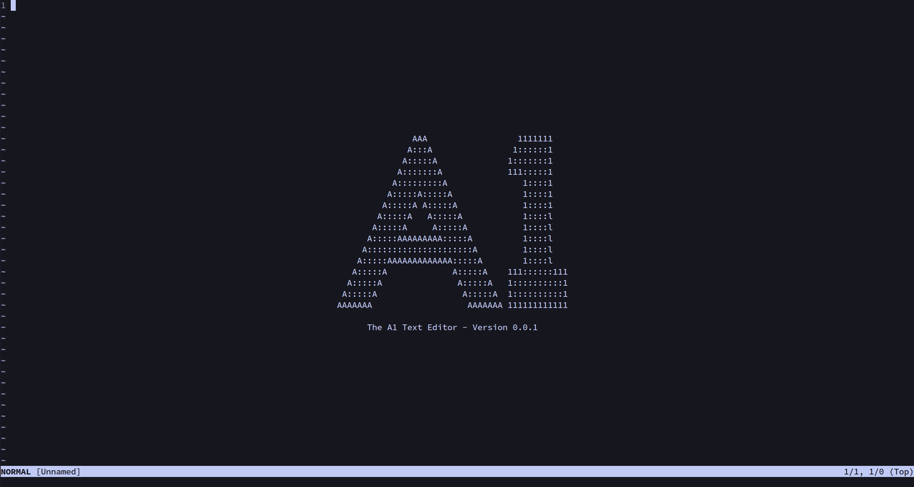
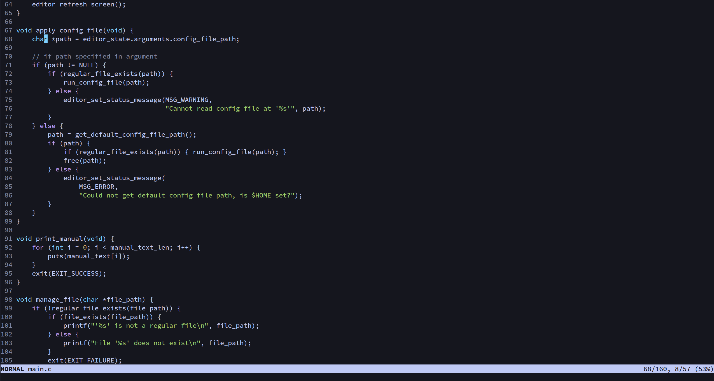

# A1





---

### Overview

A Vim inspired, terminal-based text editor written in C.

**Features**
- Four modes: Normal, Insert, Command and Find
- Basic syntax highlighting
- Undo/redo functionality (TODO)

---

### Usage

##### Main
```bash
git clone 'https://github.com/tristan-harris/A1'
cd A1
make # build
sudo make install # copy binary to /usr/local/bin (optional)
```
##### Manual

To learn how to use and configure A1, a short manual is provided. This can be viewed by running A1 with the `--manual` flag, which is best piped into a pager as demonstrated below:
```bash
./a1 --manual | less
```
The source file for this manual can also be viewed [here](https://github.com/tristan-harris/A1/blob/main/src/manual.c).

---

### Acknowledgement

A1 is a continuation of the [tutorial by Page Ruten (snaptoken)](https://viewsourcecode.org/snaptoken/kilo/index.html), which is in turn based on the [text editor written by Salvatore Sanfilippo (antirez)](https://github.com/antirez/kilo).
